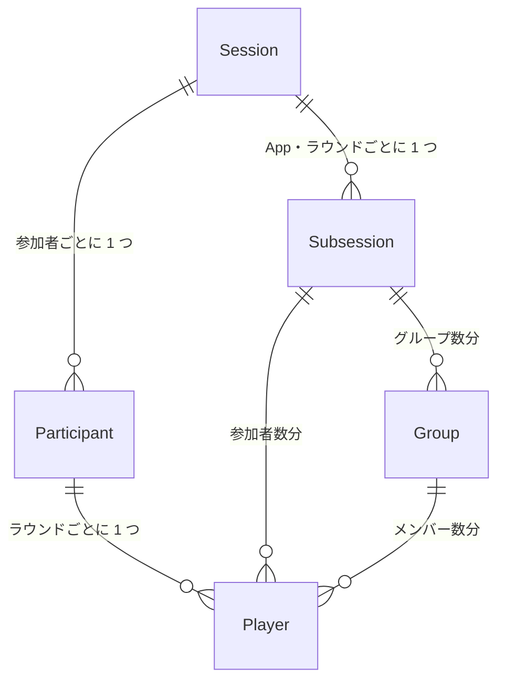

+++
draft = false
title = 'oTree の ORM モデル'
weight = 4
math = true
+++

oTree における {} モデルと実験用語および oTree の概念との対応関係は以下のようになっています。

| 実験用語   | oTree の概念 | ORM モデル |
| ---------- | ------------ | ---------|
| セッション | Session      | Session   |
| パート     | App          | 該当なし  |
| ラウンド   | Subsession   | Subsession |
| ステージ   | Page         | 該当なし  |
| 参加者     | Participant  | Participant |
| グループ   | Group        | Group |
| プレイヤー | Player       | Player |

見ての通り、App と Page に対応する ORM モデルがありません。
ORM モデルがあるものはデータベースに保存され、ないものは保存されません。
これを踏まえて、どの ORM モデルにデータを残すかを設計する必要があります。
また、ORM モデルのインスタンスが作成されるのは、当該テーブルのデータを 1 行追加することと同じです。

例えば、`Player` クラスのインスタンスを 1 つ作成すると、`Player` テーブルにデータが 1 行追加されます。
また、このインスタンスの値を変更すると、該当する行のデータの値が変更されます。

## Session

Session は他の ORM モデルとは異なり、`Session` というクラスを作る必要はありません。
また、実験中にこの `Session` インスタンスの値は変更しません。
`Session` インスタンスには、セッションの ID や設定情報が保存されます。
また、MTurk を使っている場合には、MTurk の情報もここに入ります。

## Subsession

表に書いてある通り、実験におけるパート、oTree でいう App に対応する ORM モデルは存在しません。
例えば、パート 1 で独裁者ゲームを 2 回行った場合、このパートのサマリーを保持するようなテーブルは作成されません。

oTree では `Subsession` という、ラウンドレベルのデータをデフォルトで使用します。
`Subsession` は、パート内でのラウンド数の値を持っています。

また、ステージレベルの情報を集約する ORM モデルもありません。
ただし、`Page` クラスという画面に関するクラスは存在します。

## Participant

`Participant` も、`Session` と同様に、`Participant` クラスを作る必要はありません。
このインスタンスには、実験全体での一意な参加者 ID や参加しているセッションの ID、セッション内の一意な ID などが保存されます。
また、参加者単位のデータ、例えば報酬額や参加状態 (ステータス) なども扱います。

{}
oTree 6.0 から、`Participant` に参加者のステータスに関するフィールド (`participant.status`) が追加されました。
詳細は[こちら](https://otree.readthedocs.io/en/latest/misc/version_history.html#participant-status)を参照してください。

{}

## Group, Player

実験参加者の選択データは、主に `Group`、`Player` に格納します。
`Group` はグループレベルのデータ、`Player` はプレイヤーレベルのデータを扱います。

データをどのレベルで保持・格納するかは、実験デザインや実験者の裁量に依存します。
例えば、独裁者ゲームを行う場合、各ラウンドでペアの内 1 人 (独裁者役) が選択を行います。
独裁者役が選択した配分量を `Group` インスタンスに保存しても良いですし、`Player` インスタンスに保存しても良いです。
後者の場合は、独裁者役の `Player` インスタンスの選択データのみに値が入り、受け手役は欠損値を入れます (もしくは初期値)。

`Group` インスタンスに値を入れると、受け手側の報酬計算の時に、ペアのプレイヤーのデータまで参照する必要がないため楽です。
一方で、`Player` インスタンスに値を入れると、分析の時に独裁者役の選択データが含まれているので、例えば属性や他パートでの選択との関連を調べるときに楽になります。
場合によっては、両方にデータを入れておくというのも選択としてありえます。

## ORM モデル間の関係

例えば、4 人の参加者で独裁者ゲームを 2 ラウンド行う場合、以下のようなインスタンスが作成されます。

```
Session
├── Participant A
├── Participant B
├── Participant C
├── Participant D
├── Subsession (ラウンド 1)
│   ├── Group 1
│   │   ├── Player 1 ← Participant A
│   │   └── Player 2 ← Participant B
│   └── Group 2
│       ├── Player 3 ← Participant C
│       └── Player 4 ← Participant D
└── Subsession (ラウンド 2)
    ├── Group 1
    │   ├── Player 1 ← Participant A
    |   └── Player 3 ← Participant C
    └── Group 2
        ├── Player 2 ← Participant B
        └── Player 4 ← Participant D
```

この関係を {} で表すと以下のようになります。



ポイントは以下の通りです。

- 各ラウンドごとに `Subsession` が作成され、その下に `Group` と `Player` が紐づく
- `Participant` は 1 人の参加者につき 1 つ
- `Player` はラウンドごとに作成される（2 ラウンドなら 1 人につき 2 つ）
- `Player` は `Group` と `Subsession` の両方に紐づく


各インスタンスから、紐づいているインスタンスへアクセスすることができます。
直接紐づいていないインスタンスは、関連するインスタンスを通じてアクセスします。
先の 4 人でのセッション例で、ラウンド 1 の Player 1 から同じグループ (Group 1) の Player 2 のインスタンスにアクセスするには、まず Group 1 にアクセスしてから、Group 1 に属している自分以外のメンバー (ここでは Player 2) にアクセスします。