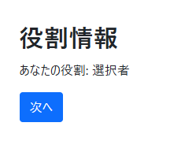
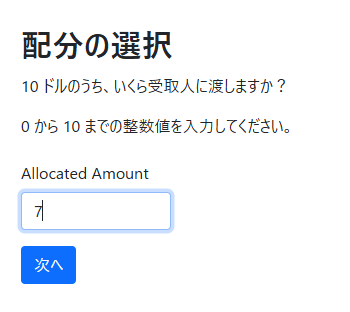
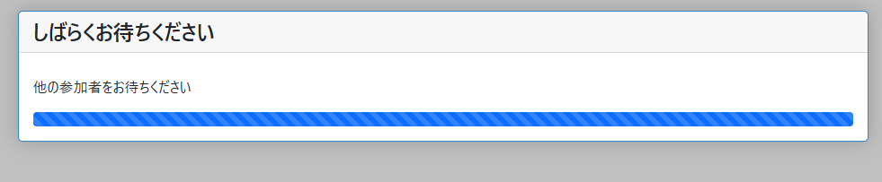
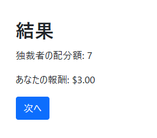

+++
title = "動作確認"
weight = 6
draft = false
+++

このステップでは、作成した独裁者ゲームを実際に実行してみます。

## 設定ファイルの修正

まずは設定ファイルを変更する必要があります。
oTree プロジェクトを作成したときは、次のようになっているはずです。

```python { title="settings.py" }

from os import environ

SESSION_CONFIGS = [
    # dict(
    #     name='public_goods',
    #     app_sequence=['public_goods'],
    #     num_demo_participants=3,
    # ),
]

# if you set a property in SESSION_CONFIG_DEFAULTS, it will be inherited by all configs
# in SESSION_CONFIGS, except those that explicitly override it.
# the session config can be accessed from methods in your apps as self.session.config,
# e.g. self.session.config['participation_fee']

SESSION_CONFIG_DEFAULTS = dict(
    real_world_currency_per_point=1.00, participation_fee=0.00, doc=""
)

PARTICIPANT_FIELDS = []
SESSION_FIELDS = []

# ISO-639 code
# for example: de, fr, ja, ko, zh-hans
LANGUAGE_CODE = 'en'

# e.g. EUR, GBP, CNY, JPY
REAL_WORLD_CURRENCY_CODE = 'USD'
USE_POINTS = True

ADMIN_USERNAME = 'admin'
# for security, best to set admin password in an environment variable
ADMIN_PASSWORD = environ.get('OTREE_ADMIN_PASSWORD')

DEMO_PAGE_INTRO_HTML = """ """

SECRET_KEY = '7743564990636'

```

ここでは、次の 3 点だけを変更します。

- 言語設定を日本語に
  - `LANGUAGE_CODE = "ja"` に変更
- 報酬ポイントは使用しない
  - `USE_POINTS = False` に変更
- セッションの設定を登録する
  - `SESSION_CONFIGS` を修正する

`SESSION_CONFIGS` は、oTree で実行するセッションの設定のリストです。
セッションの設定とは、アプリケーションの順番や、参加報酬額、アプリの条件などを指します。
実験時には、登録しておいた設定のうち 1 つを選びます。

セッションの設定は、辞書型 (`dict`) を使います。
各セッション設定で指定する主な項目は次の通りです。

| 項目 | 型 | 説明 | 例 |
|------|-----|------|-----|
| `name` | `str` | セッションの識別名 | `"dictator_game"` |
| `app_sequence` | `list` | 実行するアプリのリスト | `["dictator"]` |
| `num_demo_participants` | `int` | デモプレイ時の参加者数 | `2` |

今回の例だと、次のように設定しておきます。

```python
SESSION_CONFIGS = [
    {
        "name": "dictator_game",
        "app_sequence": ["dictator"],
        "num_demo_participants": 2,
    }
]
```

最終的な設定ファイルは以下の通りです。

```python { title="settings.py" }

from os import environ

SESSION_CONFIGS = [
    {
        "name": "dictator_game",
        "app_sequence": ["dictator"],
        "num_demo_participants": 2,
    }
]

# if you set a property in SESSION_CONFIG_DEFAULTS, it will be inherited by all configs
# in SESSION_CONFIGS, except those that explicitly override it.
# the session config can be accessed from methods in your apps as self.session.config,
# e.g. self.session.config['participation_fee']

SESSION_CONFIG_DEFAULTS = dict(
    real_world_currency_per_point=1.00, participation_fee=0.00, doc=""
)

PARTICIPANT_FIELDS = []
SESSION_FIELDS = []

# ISO-639 code
# for example: de, fr, ja, ko, zh-hans
LANGUAGE_CODE = 'ja'

# e.g. EUR, GBP, CNY, JPY
REAL_WORLD_CURRENCY_CODE = 'USD'
USE_POINTS = False

ADMIN_USERNAME = 'admin'
# for security, best to set admin password in an environment variable
ADMIN_PASSWORD = environ.get('OTREE_ADMIN_PASSWORD')

DEMO_PAGE_INTRO_HTML = """ """

SECRET_KEY = '7743564990636'

```

{}
GitHub でコードを確認
{}

## 開発サーバーの起動

ターミナルでプロジェクトのフォルダ (この例では `dictator-game`) に移動し、以下のコマンドを実行すると開発サーバーを実行できます。

```bash
otree devserver
```

起動に成功すると、以下のようなメッセージが表示されます。

```bash
Open your browser to http://localhost:8000/
To quit the server, press Control+C.
```

## デモプレイ

<video controls width="80%">
  <source src="tutorial-demo.mp4" type="video/mp4">
</video>

ブラウザで http://localhost:8000 にアクセスすると、デモ一覧が表示されます。


`dictator_game` をクリックすると、デモ用の実験セッションが作成されます。


Single-use links という文字の下の 2 つのリンクを別タブで開きます。

{}
Split-screen view を使うと、1 画面内に複数タブを開けます。
{}

ページを開くと、次のような画面が表示されます。


{}
デバッグモードが有効な場合、画面下の Debug info に参加者情報が表示されます。
{}

進めていくと、次のような画面が表示されます。

<div class="media-grid">
  <figure class="media-grid__item">
    <div class="media-grid__media">
      
    </div>
    <figcaption class="media-grid__caption">導入画面 (Introduction.html) </figcaption>
  </figure>
  <figure class="media-grid__item">
    <div class="media-grid__media">
      
    </div>
    <figcaption class="media-grid__caption">提案画面 (Offer.html) </figcaption>
  </figure>
  <figure class="media-grid__item">
    <div class="media-grid__media">
      
    </div>
    <figcaption class="media-grid__caption">待機画面 (デフォルト使用) </figcaption>
  </figure>
  <figure class="media-grid__item">
    <div class="media-grid__media">
      
    </div>
    <figcaption class="media-grid__caption">結果画面 (Results.html) </figcaption>
  </figure>
</div>

## 次のステップ

おめでとうございます！
これで oTree を使った実験の作り方がわかりました。

次のステップとして、[ガイド]({})でテストやデプロイを学んだり、[リファレンス]({})で詳細を確認したりできます。
